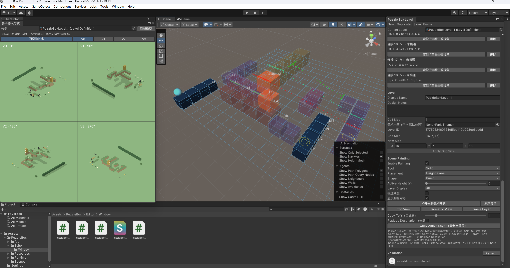
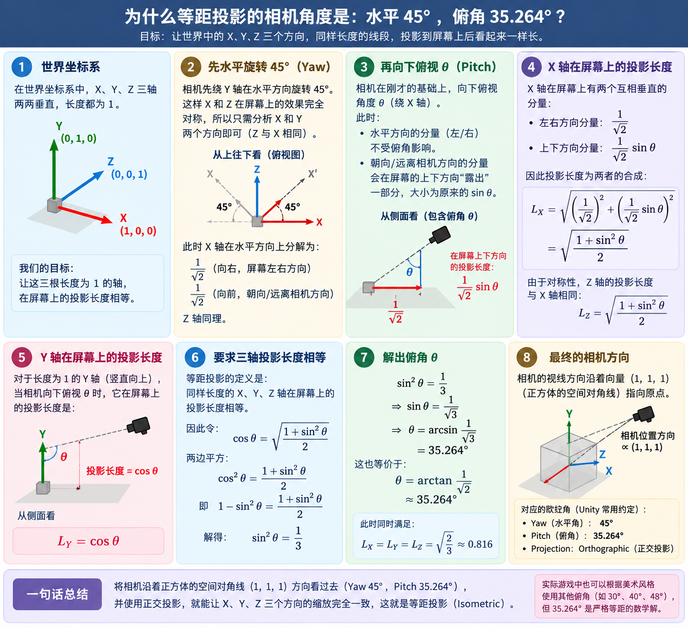

# Puzzle Box

使用 Unity 2022.3.51f1c1、URP 制作的三维错视推箱子游戏（机制来源于纪念碑谷），包含关卡编辑器和一个可玩关卡。

**使用范围：仅限个人非商业学习。未经书面许可，不得用于商业项目、收费服务或商业产品。** 具体条款见 [LICENSE](LICENSE)。

## 演示视频

[观看游戏演示](./游戏演示视频.mp4)

<video src="./游戏演示视频.mp4" controls preload="none" width="100%"></video>

## 运行演示

打开 `Assets/PuzzleBox/Scenes/Level1.unity`，进入 Play Mode。

关卡数据为同目录下的 `PuzzleBoxLevel_1.asset`。旋转视角可以改变道路连接，箱子可整堆推动，并按当前画面的竖直方向下落。将所有箱子放到目标位置即可完成关卡。

| 操作 | 按键 |
| --- | --- |
| 改变朝向 | WASD / 方向键 |
| 向当前朝向移动或推箱 | Space |
| 旋转视角 | Q / E |
| 缩放镜头 | 鼠标滚轮 |
| 撤销移动、推动或视角旋转 | Z |
| 重开 | R |

移动和旋转动画结束后才能进行下一次行动。提示弹窗可用新按下的键盘按键或关闭按钮关闭。

## 关卡编辑器

入口：`Tools > Puzzle Box > Level Editor`。在 Project 中选中 `PuzzleBoxLevel_1.asset`，或将它指定为窗口中的 Current Level，即可在 Scene 视图编辑。

- 新建、复制、保存关卡；支持撤销、重做和未保存提示。
- 绘制地形、目标、箱子、出生点和楼梯，支持擦除、吸取与楼梯旋转。
- 固定高度或贴地形表面放置，支持拖画、矩形填充、体积填充和批量生成箱堆。
- 切换编辑高度、按层显示、复制楼层、调整地图尺寸，并在裁切内容前提示。
- 切换模型与逻辑块预览、编辑网格、俯视、自由观察和 V0–V3 等距视角。
- 打开光照美术预览或四视角实时对比，关卡修改后自动刷新。
- 扫描和配置错视连接，显示箱顶动态连接、前景占用和遮挡情况。
- 为当前关卡生成可玩的 `.unity` 场景，自动配置关卡显示、游戏控制器、镜头和光照。

Scene 中左键绘制，Alt 配合鼠标观察。通常在 Y=0 放地形，Y=1 放玩家、箱子和目标。修改后点击 Save，再回到 Level1 运行；新建关卡可点击“生成此关卡试玩场景…”保存并打开对应场景。



## 工程目录

```text
Assets/
  PuzzleBox/
    Editor/              关卡编辑工具与试玩场景生成
      Window/            Level Editor、四视角实时预览、Scene 绘制和预览着色
    Runtime/
      Data/              关卡定义、网格方向、楼梯与错视连接数据
      State/             运行状态、箱子位置和撤销快照
      Rules/             移动、推箱、投影、遮挡、重力和关卡校验
      View/              输入、模型生成、动画、镜头、音频与提示
    Scenes/              Level1.unity 和 PuzzleBoxLevel_1.asset
    Resources/PuzzleBox/ 默认美术主题 ParkTheme 和音频配置 AudioSettings
    Art/                 模型、预制体、材质、Shader 和音频素材
  Settings/              URP 渲染配置
Packages/                Unity 包依赖
ProjectSettings/         引擎、输入和构建设置
```

关卡资源保存初始布局，运行状态记录当前局面。编辑器行动预览与游戏共用规则引擎；规则先结算结果，显示层再播放动画。编辑器代码通过独立程序集与运行时代码分开。

## 外部资产与来源

工程中的部分美术、音效和背景音乐来自外部作品，来源与署名如下：

| 类型 | 来源 | 工程中的素材与授权说明 |
| --- | --- | --- |
| 美术模型 | [Kenney · Nature Kit](https://kenney.nl/assets/nature-kit) | 灌木、石块等模型，位于 `Assets/PuzzleBox/Art/ThirdParty/KenneyNature`。采用 CC0，保留[原始许可证](Assets/PuzzleBox/Art/ThirdParty/KenneyNature/License.txt)。 |
| 音效素材 | [Kenney · Impact Sounds](https://kenney.nl/assets/impact-sounds) | 草地脚步、木质碰撞声音，位于 `Assets/PuzzleBox/Art/Audio/KenneyImpact`。采用 CC0，保留[原始许可证](Assets/PuzzleBox/Art/Audio/KenneyImpact/License.txt)。 |
| 背景音乐 | Arvi Teikari（Hempuli）·《Baba Is You》，[原声页面](https://hempuli.itch.io/baba-is-you-soundtrack) | 工程文件为 `Assets/PuzzleBox/Art/Audio/Arvi Teikari - Baba Is You.mp3`，音乐版权归原作者。 |

第三方资产遵循各自的授权条件，本项目的许可证不替代这些素材的授权，也不限制其原许可单独授予的权利。

## 使用许可

本项目采用自定义的[学习与评审使用许可证](LICENSE)。允许为个人学习下载、运行和修改；分享或 Fork 时须保留署名、来源与许可条款，修改版同样受用途限制。

## 数学原理推导图


